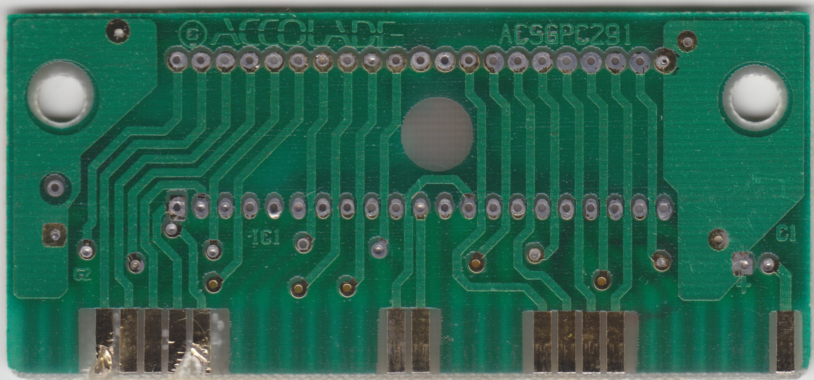
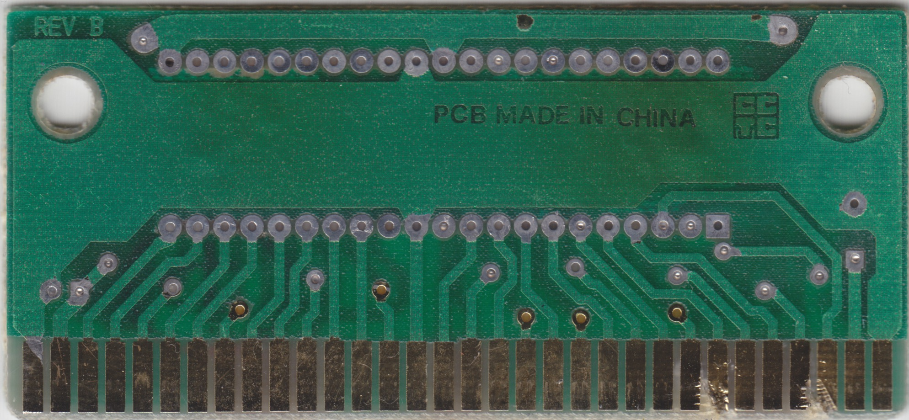

# Accolade / ACSGPC291 Rev B

16-Mbit with JEDEC pinout

## Example games

Bubsy

## Example games

|Game|IC1 chip label|
|---|---|
|Bubsy in Claws Encounters of the Furred Kind (Europe, USA)|9330 LHR ACBUSG|

## BOM

|Designator|Value|
|---|---|
|C1|47uF 16V Electrolytic|
|C2||
|IC1|See chip label above|

## Board scans

