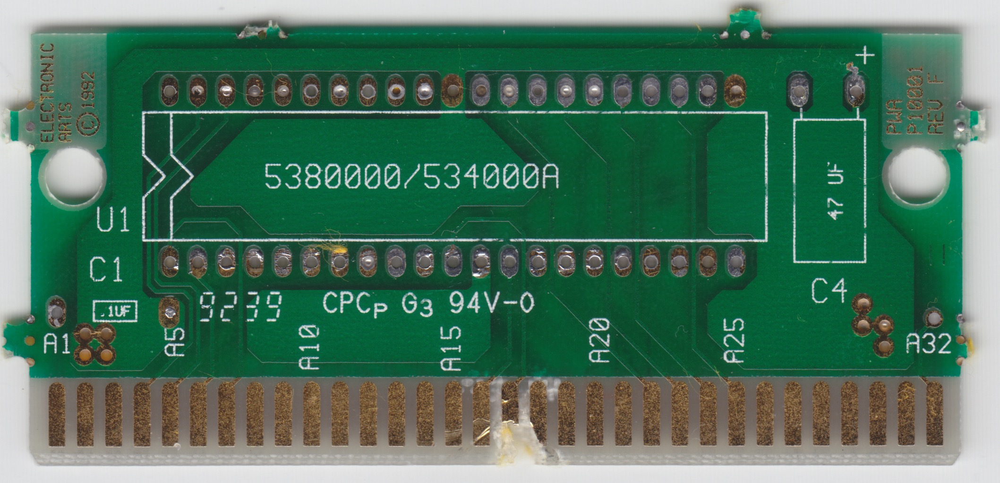
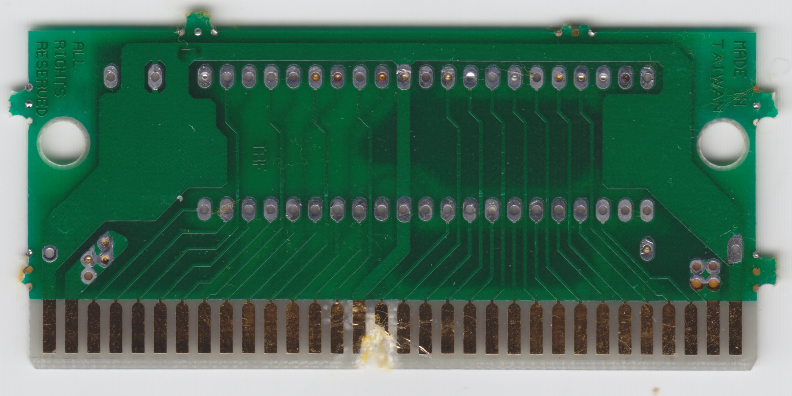

# Electronic Arts / PWA P10001 Rev F

8- or 16-Mbit with JEDEC pinout

Capacity depends on the board revision: Upto Rev G = 8M, Rev H = 8M or 16M (patched), Rev J = 16M

## Example games

|Game|U1 chip label|
|---|---|
|Risky Woods (Europe, USA)|RISKY RIS18|
|Power Monger (Europe, USA)|POWERMONGER PM14|
|Desert Strike - Return to the Gulf (Europe, USA)|Desert DES08 7022|

## BOM

|Designator|Value|
|---|---|
|C1|100nF multilayer ceramic capacitors - leaded|
|C4|47uF 16V aluminium electrolytic capacitors - leaded|
|U1|See chip label above|

## Board scans

