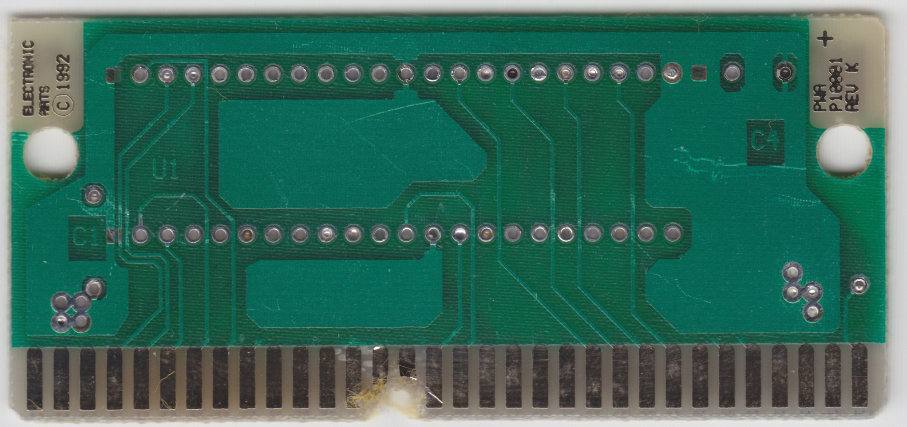
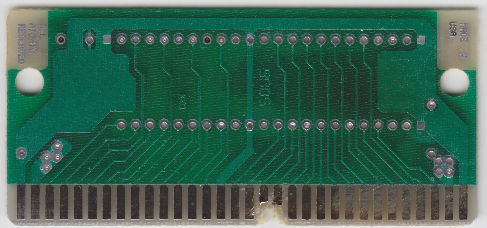

# Electronic Arts / PWA P10001 Rev K

8- or 16-Mbit with JEDEC pinout

Capacity depends on the board revision: Upto Rev G = 8M, Rev H = 8M or 16M (patched), Rev J = 16M

## Example games

Lotus 2

## Board scans

