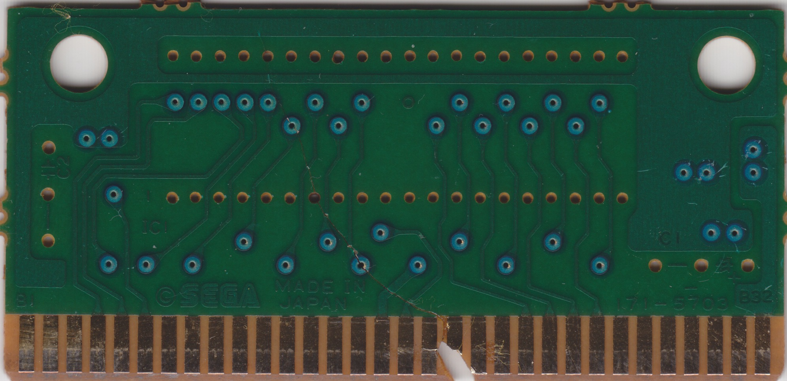
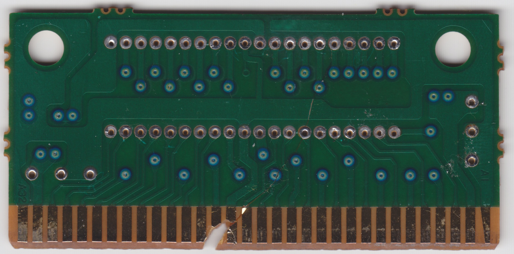

# SEGA / 171-5703

4-Mbit with JEDEC compliant pinout

## Example games

|Game|IC1 chip label|
|---|---|
|Sonic The Hedgehog|MPR-13933-F|

## BOM

|Designator|Value|
|---|---|
|C1|47uF 16V Electrolytic|
|C2||
|IC1|See chip label above|

## Board scans

