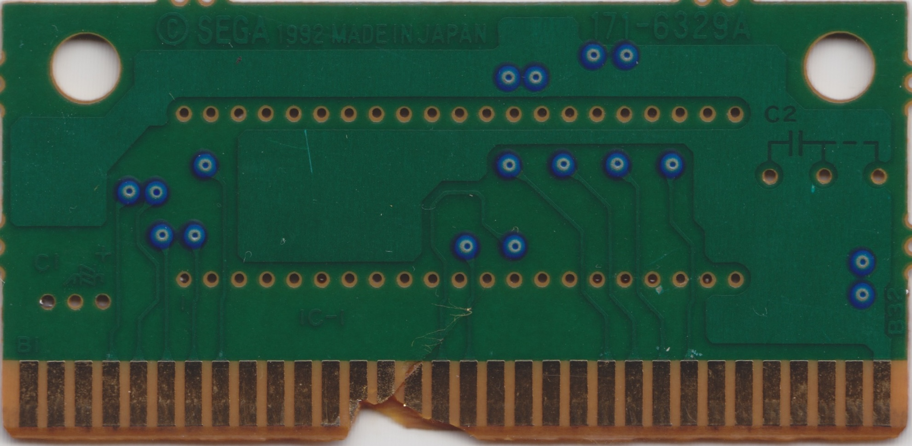
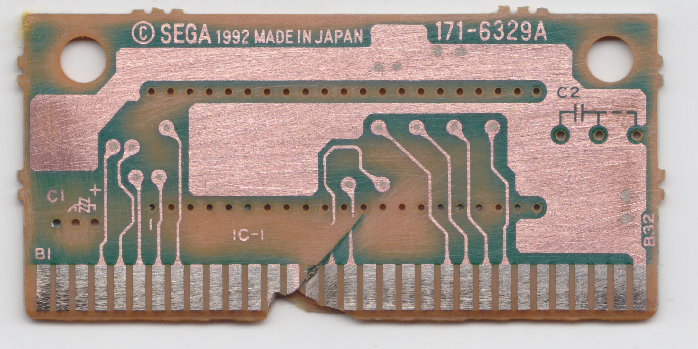
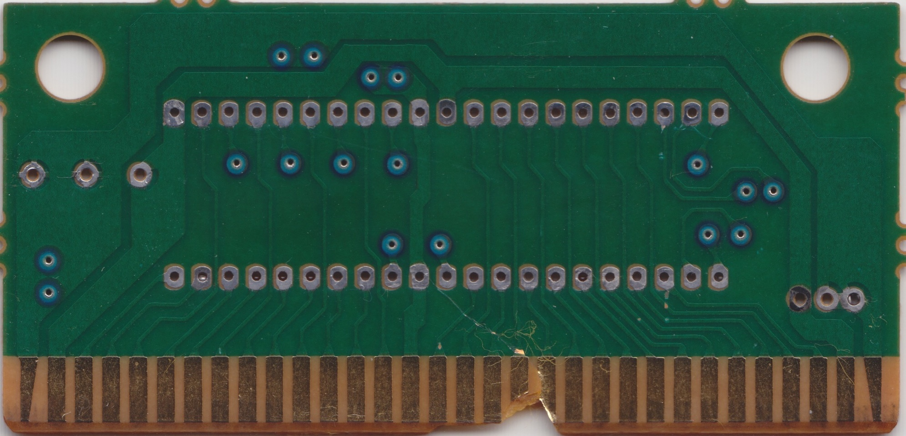
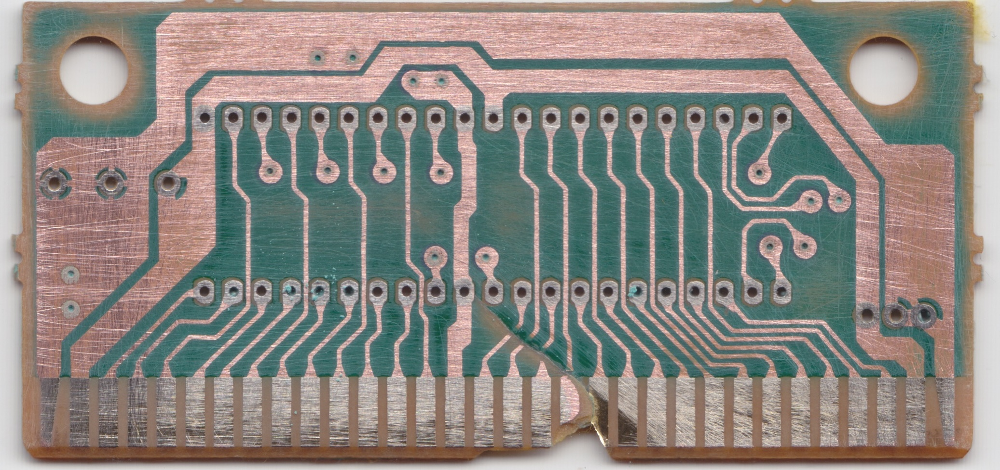

# SEGA / 171-6329A

16-Mbit with JEDEC pinout

## Example games

|Game|IC1 chip label|
|---|---|
|Fatal Fury - King of Fighters (Europe, Korea)|MPR-15418-H|

## BOM

|Designator|Value|
|---|---|
|C1|47uF 16V Electrolytic|
|C2||
|IC1|See chip label above|

## Board scans

